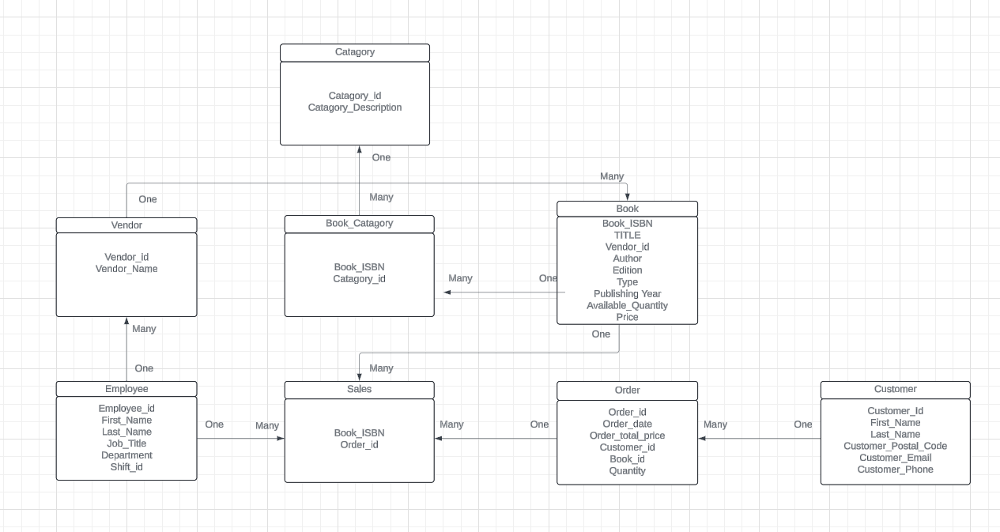
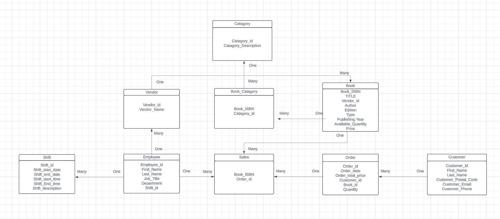
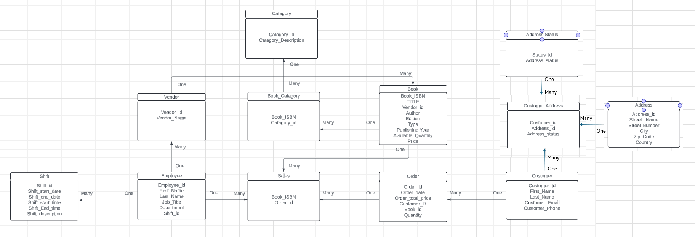

# Assignment 1: Design a Logical Model Rubric

## General
  - Criteria: Participant Name on Assignment
  - Criteria: Written content is no longer than two pages
  - Criteria: Assignment is free of noticeable typos
  - Criteria: Two ERDs exist

## Question 1

  - **Tables**
    - Employee: Relates to employees.
    - Order: Relates to order processing.
    - Sales: Relates to sales transactions.
    - Customer: Relates to customer information.
    - Book: Relates to inventory of books.

  - **Tables Exist**: All five tables need to exist.
  - **Column Relevance**: Each table must have named columns that relate to their respective entities and include columns relevant for bookstore administration. (**🚨EACH table will be graded as complete or incomplete🚨**)
  - **Relationships Indicated**: Clear relationships between the aforementioned tables must be established.
  - **Date Table**: 
    - Must exist with typical columns.
    - Must have correct relationships with other relevant tables indicated.
   **Solution:  
         
## Question 2
- Employee Shift Table exists, and we can discern morning/evening shifts from its design**
   **Solution:  
           
## Question 3: 
- **Two distinct architectures are proposed**
- **One design for Customer Addresses table would retain changes**
- **One design for Customer Addresses table would overwrite changes**
- **Each architecture is properly labelled as either Type 1 or Type 2 SCD**
    - Both Correct (Complete)
    - One Wrong (Incomplete)
    - Both Wrong (Incomplete)
   **Solution:  
           

## Question 4: 
- **AdventureWorks ERD has been examined**
- **Two interesting differences between participant ERDs and AdventureWorks ERDs highlighted**
- **Student reflection on differences between the ERDs**
   **Solution:  

          1.Participant ERDs are more specialized (tailored for specific applications or projects), while AdventureWorks ERDs provide a comprehensive overview suitable for a variety of business scenarios.  
          2. Participant-ERD vary in complexity depending on the project's needs While adventureWorks generally more complex (gives more features & capabilities)  
          

## Criteria

|Criteria|Complete|Incomplete|
|--------|----|----|
|Question 1 Requirements|All requirements are met.|At least one requirement is not met.|
|Question 2 Requirements|All requirements are met.|At least one requirement is not met.|
|Question 3 Requirements|All requirements are met.|At least one requirement is not met.|
|Question 4 Requirements|All requirements are met.|At least one requirement is not met.|
