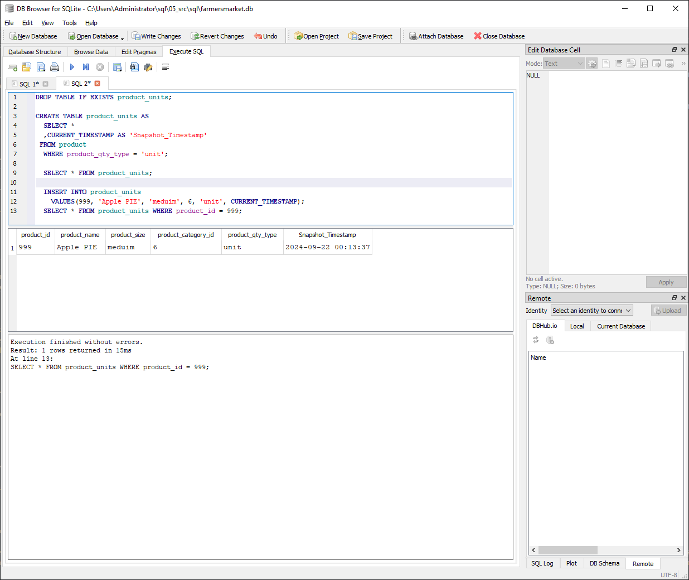
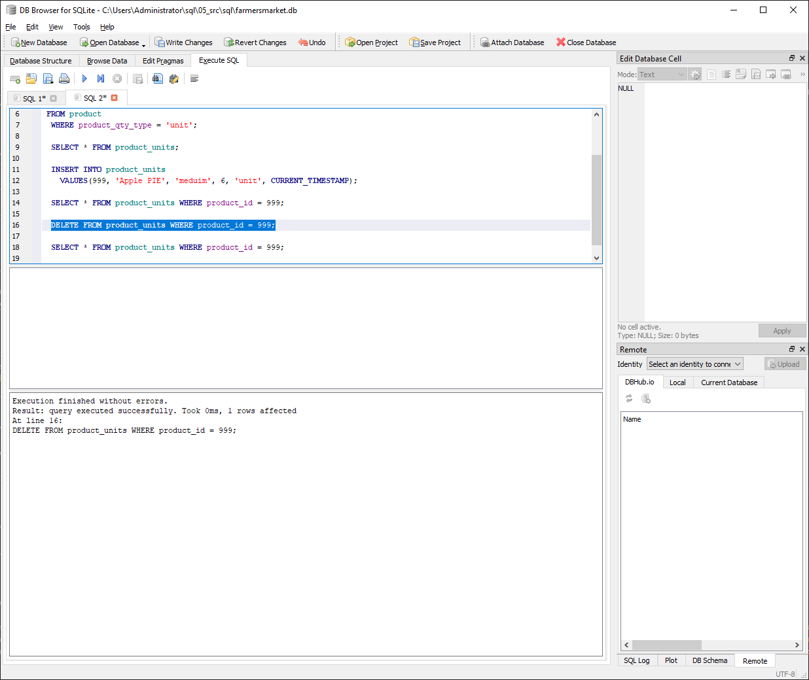
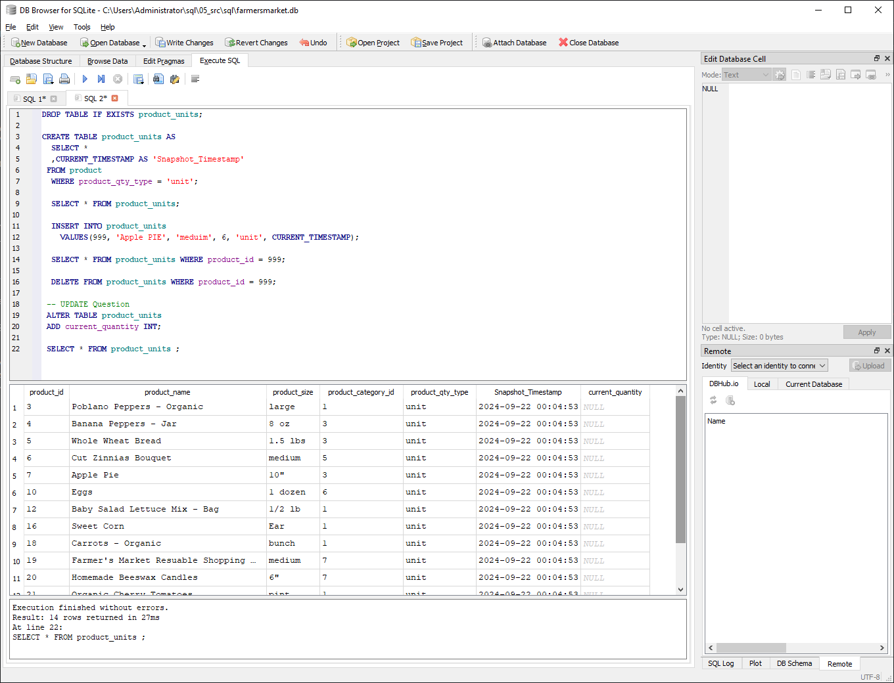

# Homework 4: Advanced SQL

-  	Due on Thursday, September 19 at 11:59pm
-  	Weight: 8% of total grade
-  	Upload one .sql file with your queries

# COALESCE
1. Our favourite manager wants a detailed long list of products, but is afraid of tables! We tell them, no problem! We can produce a list with all of the appropriate details. 

Using the following syntax you create our super cool and not at all needy manager a list:
```
SELECT 
product_name || ', ' || product_size|| ' (' || product_qty_type || ')'
FROM product
```

But wait! The product table has some bad data (a few NULL values). 
Find the NULLs and then using COALESCE, replace the NULL with a blank for the first problem, and 'unit' for the second problem. 

**HINT**: keep the syntax the same, but edited the correct components with the string. The `||` values concatenate the columns into strings. Edit the appropriate columns -- you're making two edits -- and the NULL rows will be fixed. All the other rows will remain the same. <br>
 <br> **Solution:** <br>
      SELECT 
      product_name || ', ' || COALESCE(product_size, ' ')|| ' (' || COALESCE(product_qty_type, ' ') || ')'
      FROM product;
         <br>


# Windowed Functions
1. Write a query that selects from the customer_purchases table and numbers each customer’s visits to the farmer’s market (labeling each market date with a different number). Each customer’s first visit is labeled 1, second visit is labeled 2, etc. 
    
You can either display all rows in the customer_purchases table, with the counter changing on each new market date for each customer, or select only the unique market dates per customer (without purchase details) and number those visits. 
**HINT**: One of these approaches uses ROW_NUMBER() and one uses DENSE_RANK(). <br>
     <br> **Solution:** <br>
     SELECT customer_id, market_date, <br>
     ROW_NUMBER() OVER(PARTITION BY customer_id ORDER BY market_date ASC) AS 'Visit Number' <br>
     FROM customer_purchases; <br>
     
     <br>
2. Reverse the numbering of the query from a part so each customer’s most recent visit is labeled 1, then write another query that uses this one as a subquery (or temp table) and filters the results to only the customer’s most recent visit. <br>
<br> **Solution:** <br>
        SELECT customer_id, MAX(market_date),  <br>
        ROW_NUMBER() OVER(PARTITION BY customer_id ORDER BY market_date DESC) AS 'Visit Number'  <br>
        FROM customer_purchases <br>
        GROUP BY customer_id <br>
        

3. Using a COUNT() window function, include a value along with each row of the customer_purchases table that indicates how many different times that customer has purchased that product_id.
<br> <br> **Solution:** <br>
       DROP TABLE IF EXISTS temp.customer_purchases;  <br>
       CREATE TEMP TABLE temp.customer_purchases AS  <br> 
<br>   SELECT customer_id,  product_id  <br>
           FROM customer_purchases;   
<br>       SELECT *, <br>
           Count(product_id) AS 'No. of Times product purchased' <br>
           FROM temp.customer_purchases <br>
           GROUP BY product_id, customer_id <br>
           ORDER BY customer_id; <br>
           

# String manipulations
1. Some product names in the product table have descriptions like "Jar" or "Organic". These are separated from the product name with a hyphen. Create a column using SUBSTR (and a couple of other commands) that captures these, but is otherwise NULL. Remove any trailing or leading whitespaces. Don't just use a case statement for each product! 

| product_name               | description |
|----------------------------|-------------|
| Habanero Peppers - Organic | Organic     |

**HINT**: you might need to use INSTR(product_name,'-') to find the hyphens. INSTR will help split the column. 
<br> <br> **Solution:** <br>
       SELECT product_name,  <br> 
       ( SUBSTR(product_name, NULLIF(INSTR(product_name,'-'),0)+2,43))  AS 'Description'   <br>
       FROM product;    <br>
      

# UNION
1. Using a UNION, write a query that displays the market dates with the highest and lowest total sales.

**HINT**: There are a possibly a few ways to do this query, but if you're struggling, try the following: 1) Create a CTE/Temp Table to find sales values grouped dates; 2) Create another CTE/Temp table with a rank windowed function on the previous query to create "best day" and "worst day"; 3) Query the second temp table twice, once for the best day, once for the worst day, with a UNION binding them. 
<br> <br>**Solution:** <br>
       DROP TABLE IF EXISTS temp.purchases; <br>
       CREATE TEMP TABLE temp.purchases AS <br>
<br>
       SELECT *, <br>
       SUM((quantity*cost_to_customer_per_qty)) AS 'Total_Purchases' <br>
       FROM customer_purchases <br>
       GROUP BY market_date;
<br>
<br>
       SELECT market_date, MAX(Total_Purchases) AS 'Highest/Lowest Sales' FROM temp.purchases <br>
       UNION ALL <br>
       SELECT market_date, Min(Total_purchases) FROM temp.purchases; <br>
       