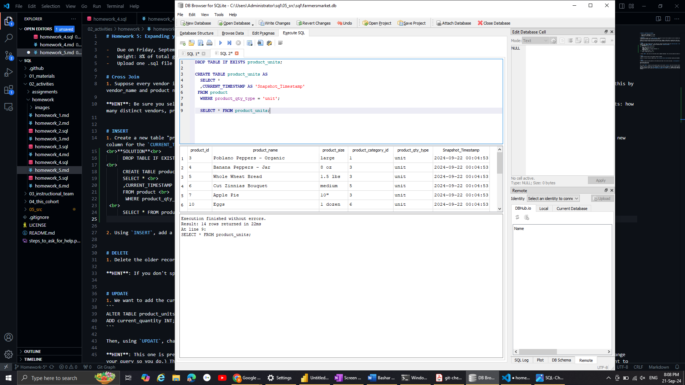

# Homework 5: Expanding your Database

-  	Due on Friday, September 20 at 11:59pm
-  	Weight: 8% of total grade
-  	Upload one .sql file with your queries

# Cross Join
1. Suppose every vendor in the `vendor_inventory` table had 5 of each of their products to sell to **every** customer on record. How much money would each vendor make per product? Show this by vendor_name and product name, rather than using the IDs.

**HINT**: Be sure you select only relevant columns and rows. Remember, CROSS JOIN will explode your table rows, so CROSS JOIN should likely be a subquery. Think a bit about the row counts: how many distinct vendors, product names are there (x)? How many customers are there (y). Before your final group by you should have the product of those two queries (x\*y). 


# INSERT
1. Create a new table "product_units". This table will contain only products where the `product_qty_type = 'unit'`. It should use all of the columns from the product table, as well as a new column for the `CURRENT_TIMESTAMP`.  Name the timestamp column `snapshot_timestamp`.
<br>**SOLUTION**<br>
      DROP TABLE IF EXISTS product_units;
<br>
      CREATE TABLE product_units AS <br>
      SELECT * <br>
      ,CURRENT_TIMESTAMP AS 'Snapshot_Timestamp' <br>
      FROM product <br>
       WHERE product_qty_type = 'unit'; 
 <br> 
      SELECT * FROM product_units; <br>
      

2. Using `INSERT`, add a new row to the table (with an updated timestamp). This can be any product you desire (e.g. add another record for Apple Pie). 
<br>**SOLUTION**<br>
       INSERT INTO product_units <br>
       VALUES(999, 'Apple PIE', 'meduim', 6, 'unit', CURRENT_TIMESTAMP); <br>
       SELECT * FROM product_units WHERE product_id = 999;   <br>
       

# DELETE 
1. Delete the older record for the whatever product you added.

**HINT**: If you don't specify a WHERE clause, [you are going to have a bad time](https://imgflip.com/i/8iq872).
<br>**SOLUTION**<br>
       DELETE FROM product_units WHERE product_id = 999; <br>
       

# UPDATE
1. We want to add the current_quantity to the product_units table. First, add a new column, `current_quantity` to the table using the following syntax.
```
ALTER TABLE product_units
ADD current_quantity INT;
```

Then, using `UPDATE`, change the current_quantity equal to the **last** `quantity` value from the vendor_inventory details. 

**HINT**: This one is pretty hard. First, determine how to get the "last" quantity per product. Second, coalesce null values to 0 (if you don't have null values, figure out how to rearrange your query so you do.) Third, `SET current_quantity = (...your select statement...)`, remembering that WHERE can only accommodate one column. Finally, make sure you have a WHERE statement to update the right row, you'll need to use `product_units.product_id` to refer to the correct row within the product_units table. When you have all of these components, you can run the update statement.

<br>**SOLUTION**<br>
      ALTER TABLE product_units <br>
      ADD current_quantity INT; <br>
      
